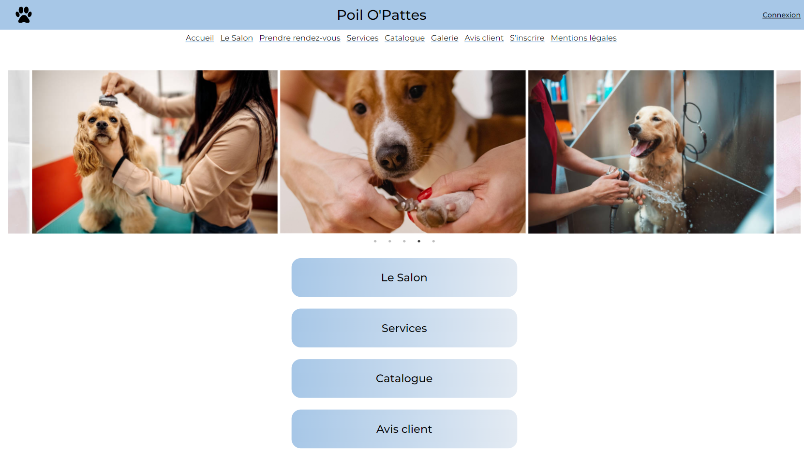

# Poil-O-Pattes

## Description


link: https://poilsopattes.raffiskender.com/

<p align="center">
</p>

## Stack and tools
* [React](https://reactjs.org/)
* [Redux](https://redux.org/)
* [Figma](https://www.figma.com/)
* [SASS](https://sass.com/)
* [Jest](https://jestjs.io/fr/)

## Install the project 

```
# Clone the repository
$ git clone git@github.com:O-clock-De-Vinci/projet-poil-o-pattes-front.git

# Access the project folder at the command prompt
$ cd projet-poil-o-pattes-front

# Install the dependencies
$ yarn

# Run the script 
$ yarn start

```
